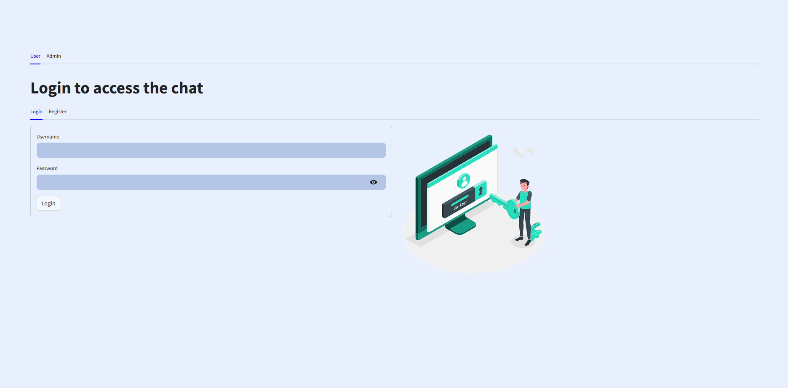
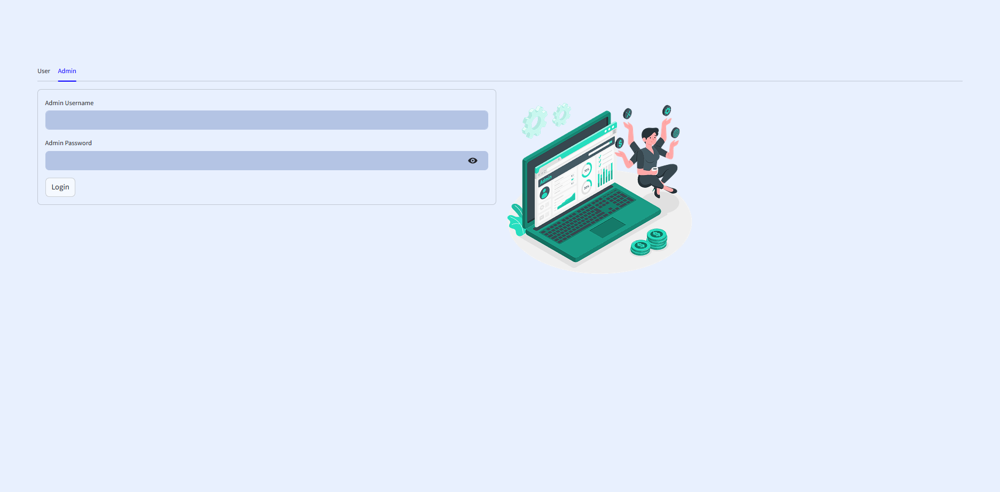

# RAG-Chatbot
RAG-Chatbot is an internal chatbot system designed specifically for use within a department of a company. It provides two separate user interfaces:
- Admin Interface: for departmental staff members who are responsible for managing users, monitoring usage, and overseeing chatbot performance.
- User Interface: for general users in the department to interact with the chatbot and receive intelligent, context-aware responses.

The system leverages Retrieval-Augmented Generation (RAG) techniques, combining LLMs with internal documents or databases to deliver accurate, up-to-date answers. It is fully containerized using Docker, making deployment and management simple and portable across different environments.
## Features

- **Retrieval-Augmented Generation**: Combines information retrieval with generative models for accurate and context-aware responses.
- **Augmented Features**: Web search (Google API, Serper API), CSV file handler (more accuracy), Documents based project (admin can upload project folders for their employees, and user can create their own project folders)
- **Dockerized Deployment**: Utilizes Docker and Docker Compose for easy setup and environment consistency.
- **Modular Architecture**: Separates components into distinct services for maintainability and scalability. 
## Admin & User Interfaces
- **User Chat**:
  - Documents based conversation (RAG).
  - CSV Agent.
  - Web search.

- **Admin Dashboard**:  
  - Modify API key for their users.
  - Add, edit, delete project folder for their users.
  - Admin's accounts and passwords are: 
    - `Admin Username: Admin1`, `Admin Password: thisaccountisjustforadmin1`
    - `Admin Username: Admin2`, `Admin Password: thisaccountisjustforadmin2`
    - You can change it in `init.sql`.

## Prerequisites

- [Docker](https://www.docker.com/get-started) installed on your machine.
- [Docker Compose](https://docs.docker.com/compose/install/) installed.
- Ensure the following ports are **not in use** on your host machine to avoid conflicts:
  - `9999`: PostgreSQL database port
  - `9000`: FastAPI port
  - `9501`: UI streamlit port
  - `90` : Nginx port

## Getting Started

### 1. Clone the Repository

```bash
git clone https://github.com/Bojjoo/RAG-Chatbot.git
cd RAG-Chatbot
```


### 2. Build and Run with Docker Compose

```bash
docker-compose up --build -d
```


### 3. Access the Application

- **Frontend**: Open your browser and navigate to `http://localhost:9501` to interact with the chatbot interface.
- **API Endpoint**: Access the API at `http://localhost:9000`.

## Services Overview

The application comprises the following Docker services:
- **FastAPI**: Manages API requests and integrates retrieval and generation components.
- **Nginx**: Serves as a reverse proxy and handles SSL termination.
- **Streamlit**: Provides the frontend interface for user interaction. 
- **PostgreSQL**: For storing user information and conversations.

Each service is defined in the `docker-compose.yml` file with specific port mappings and dependencies.

## Contact

For questions or support, reach out via email: `hieu.nguyenngoc2054@gmail.com`.
